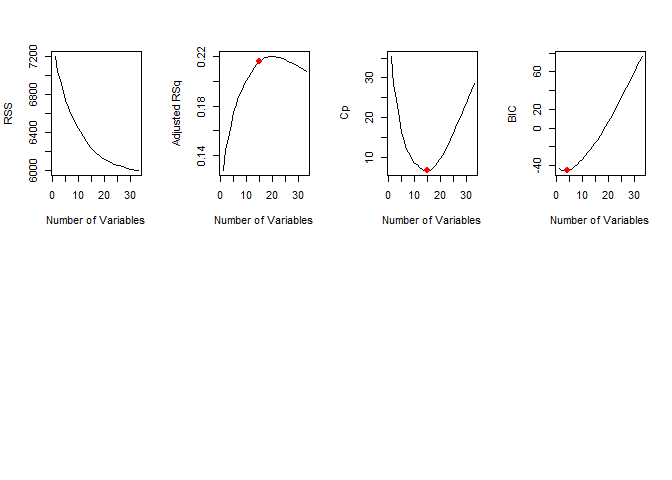

Finding Important Variables - Advance ML - Linear Approach
================
Nima Niarad
7/15/2021

<style> body {text-align: justify} </style>

<!-- Justify text. -->

### Identifying the Key Variables

``` r
library(dplyr)
```

    ## 
    ## Attaching package: 'dplyr'

    ## The following objects are masked from 'package:stats':
    ## 
    ##     filter, lag

    ## The following objects are masked from 'package:base':
    ## 
    ##     intersect, setdiff, setequal, union

``` r
library(tidyr)

MatStudent=read.table("C:/Nima/Rstudio/Git/Finding Important Variables - Advance ML - Linear Approach/Finding-Important-Variables---Advance-ML---Linear-Approach/student-mat.csv",sep=";",header=TRUE)

MatStudent =na.omit(MatStudent)
```

### Best Subset Selection - BSS

``` r
library(leaps)
regfit.full = regsubsets(G3 ~ . -G1 - G2, MatStudent, nvmax =33)
summary(regfit.full)
```

    ## Subset selection object
    ## Call: regsubsets.formula(G3 ~ . - G1 - G2, MatStudent, nvmax = 33)
    ## 39 Variables  (and intercept)
    ##                  Forced in Forced out
    ## schoolMS             FALSE      FALSE
    ## sexM                 FALSE      FALSE
    ## age                  FALSE      FALSE
    ## addressU             FALSE      FALSE
    ## famsizeLE3           FALSE      FALSE
    ## PstatusT             FALSE      FALSE
    ## Medu                 FALSE      FALSE
    ## Fedu                 FALSE      FALSE
    ## Mjobhealth           FALSE      FALSE
    ## Mjobother            FALSE      FALSE
    ## Mjobservices         FALSE      FALSE
    ## Mjobteacher          FALSE      FALSE
    ## Fjobhealth           FALSE      FALSE
    ## Fjobother            FALSE      FALSE
    ## Fjobservices         FALSE      FALSE
    ## Fjobteacher          FALSE      FALSE
    ## reasonhome           FALSE      FALSE
    ## reasonother          FALSE      FALSE
    ## reasonreputation     FALSE      FALSE
    ## guardianmother       FALSE      FALSE
    ## guardianother        FALSE      FALSE
    ## traveltime           FALSE      FALSE
    ## studytime            FALSE      FALSE
    ## failures             FALSE      FALSE
    ## schoolsupyes         FALSE      FALSE
    ## famsupyes            FALSE      FALSE
    ## paidyes              FALSE      FALSE
    ## activitiesyes        FALSE      FALSE
    ## nurseryyes           FALSE      FALSE
    ## higheryes            FALSE      FALSE
    ## internetyes          FALSE      FALSE
    ## romanticyes          FALSE      FALSE
    ## famrel               FALSE      FALSE
    ## freetime             FALSE      FALSE
    ## goout                FALSE      FALSE
    ## Dalc                 FALSE      FALSE
    ## Walc                 FALSE      FALSE
    ## health               FALSE      FALSE
    ## absences             FALSE      FALSE
    ## 1 subsets of each size up to 33
    ## Selection Algorithm: exhaustive
    ##           schoolMS sexM age addressU famsizeLE3 PstatusT Medu Fedu Mjobhealth
    ## 1  ( 1 )  " "      " "  " " " "      " "        " "      " "  " "  " "       
    ## 2  ( 1 )  " "      " "  " " " "      " "        " "      "*"  " "  " "       
    ## 3  ( 1 )  " "      "*"  " " " "      " "        " "      "*"  " "  " "       
    ## 4  ( 1 )  " "      "*"  " " " "      " "        " "      " "  " "  "*"       
    ## 5  ( 1 )  " "      "*"  " " " "      " "        " "      " "  " "  "*"       
    ## 6  ( 1 )  " "      "*"  " " " "      " "        " "      "*"  " "  "*"       
    ## 7  ( 1 )  " "      "*"  " " " "      " "        " "      "*"  " "  "*"       
    ## 8  ( 1 )  " "      "*"  " " " "      " "        " "      "*"  " "  "*"       
    ## 9  ( 1 )  " "      "*"  " " " "      " "        " "      "*"  " "  "*"       
    ## 10  ( 1 ) " "      "*"  " " " "      " "        " "      "*"  " "  "*"       
    ## 11  ( 1 ) " "      "*"  " " " "      " "        " "      "*"  " "  "*"       
    ## 12  ( 1 ) " "      "*"  "*" " "      " "        " "      " "  " "  "*"       
    ## 13  ( 1 ) " "      "*"  "*" " "      " "        " "      " "  " "  "*"       
    ## 14  ( 1 ) " "      "*"  "*" " "      " "        " "      " "  " "  "*"       
    ## 15  ( 1 ) " "      "*"  "*" " "      " "        " "      " "  " "  "*"       
    ## 16  ( 1 ) " "      "*"  "*" " "      "*"        " "      " "  " "  "*"       
    ## 17  ( 1 ) " "      "*"  "*" "*"      "*"        " "      " "  " "  "*"       
    ## 18  ( 1 ) " "      "*"  "*" "*"      "*"        " "      "*"  " "  "*"       
    ## 19  ( 1 ) " "      "*"  "*" "*"      "*"        " "      " "  " "  "*"       
    ## 20  ( 1 ) " "      "*"  "*" "*"      "*"        " "      "*"  " "  "*"       
    ## 21  ( 1 ) " "      "*"  "*" "*"      "*"        " "      "*"  " "  "*"       
    ## 22  ( 1 ) " "      "*"  "*" "*"      "*"        " "      "*"  " "  "*"       
    ## 23  ( 1 ) " "      "*"  "*" "*"      "*"        " "      "*"  " "  "*"       
    ## 24  ( 1 ) " "      "*"  "*" "*"      "*"        " "      "*"  " "  "*"       
    ## 25  ( 1 ) "*"      "*"  "*" "*"      "*"        " "      "*"  " "  "*"       
    ## 26  ( 1 ) "*"      "*"  "*" "*"      "*"        " "      "*"  " "  "*"       
    ## 27  ( 1 ) "*"      "*"  "*" "*"      "*"        " "      "*"  " "  "*"       
    ## 28  ( 1 ) "*"      "*"  "*" "*"      "*"        " "      "*"  " "  "*"       
    ## 29  ( 1 ) "*"      "*"  "*" "*"      "*"        " "      "*"  " "  "*"       
    ## 30  ( 1 ) "*"      "*"  "*" "*"      "*"        " "      "*"  " "  "*"       
    ## 31  ( 1 ) "*"      "*"  "*" "*"      "*"        " "      "*"  " "  "*"       
    ## 32  ( 1 ) "*"      "*"  "*" "*"      "*"        " "      "*"  " "  "*"       
    ## 33  ( 1 ) "*"      "*"  "*" "*"      "*"        " "      "*"  " "  "*"       
    ##           Mjobother Mjobservices Mjobteacher Fjobhealth Fjobother Fjobservices
    ## 1  ( 1 )  " "       " "          " "         " "        " "       " "         
    ## 2  ( 1 )  " "       " "          " "         " "        " "       " "         
    ## 3  ( 1 )  " "       " "          " "         " "        " "       " "         
    ## 4  ( 1 )  " "       "*"          " "         " "        " "       " "         
    ## 5  ( 1 )  " "       "*"          " "         " "        " "       " "         
    ## 6  ( 1 )  " "       "*"          " "         " "        " "       " "         
    ## 7  ( 1 )  " "       "*"          " "         " "        " "       " "         
    ## 8  ( 1 )  " "       "*"          " "         " "        " "       " "         
    ## 9  ( 1 )  " "       "*"          " "         " "        " "       " "         
    ## 10  ( 1 ) " "       "*"          " "         " "        " "       " "         
    ## 11  ( 1 ) " "       "*"          " "         " "        " "       " "         
    ## 12  ( 1 ) " "       "*"          " "         " "        " "       " "         
    ## 13  ( 1 ) " "       "*"          " "         " "        " "       " "         
    ## 14  ( 1 ) " "       "*"          " "         " "        " "       " "         
    ## 15  ( 1 ) " "       "*"          " "         " "        " "       " "         
    ## 16  ( 1 ) " "       "*"          " "         " "        " "       " "         
    ## 17  ( 1 ) " "       "*"          " "         " "        " "       " "         
    ## 18  ( 1 ) " "       "*"          " "         " "        " "       " "         
    ## 19  ( 1 ) " "       "*"          " "         " "        " "       " "         
    ## 20  ( 1 ) " "       "*"          " "         " "        " "       " "         
    ## 21  ( 1 ) " "       "*"          " "         " "        " "       " "         
    ## 22  ( 1 ) " "       "*"          " "         " "        " "       " "         
    ## 23  ( 1 ) " "       "*"          "*"         " "        " "       " "         
    ## 24  ( 1 ) " "       "*"          "*"         " "        " "       " "         
    ## 25  ( 1 ) " "       "*"          "*"         " "        " "       " "         
    ## 26  ( 1 ) " "       "*"          "*"         " "        " "       " "         
    ## 27  ( 1 ) " "       "*"          "*"         " "        " "       " "         
    ## 28  ( 1 ) " "       "*"          "*"         " "        " "       " "         
    ## 29  ( 1 ) " "       "*"          "*"         "*"        " "       " "         
    ## 30  ( 1 ) " "       "*"          "*"         "*"        " "       " "         
    ## 31  ( 1 ) " "       "*"          "*"         "*"        " "       " "         
    ## 32  ( 1 ) " "       "*"          "*"         " "        "*"       "*"         
    ## 33  ( 1 ) "*"       "*"          "*"         " "        "*"       "*"         
    ##           Fjobteacher reasonhome reasonother reasonreputation guardianmother
    ## 1  ( 1 )  " "         " "        " "         " "              " "           
    ## 2  ( 1 )  " "         " "        " "         " "              " "           
    ## 3  ( 1 )  " "         " "        " "         " "              " "           
    ## 4  ( 1 )  " "         " "        " "         " "              " "           
    ## 5  ( 1 )  " "         " "        " "         " "              " "           
    ## 6  ( 1 )  " "         " "        " "         " "              " "           
    ## 7  ( 1 )  " "         " "        " "         " "              " "           
    ## 8  ( 1 )  " "         " "        " "         " "              " "           
    ## 9  ( 1 )  " "         " "        " "         " "              " "           
    ## 10  ( 1 ) " "         " "        " "         " "              " "           
    ## 11  ( 1 ) " "         " "        " "         " "              " "           
    ## 12  ( 1 ) "*"         " "        " "         " "              " "           
    ## 13  ( 1 ) "*"         " "        " "         " "              " "           
    ## 14  ( 1 ) "*"         " "        " "         " "              " "           
    ## 15  ( 1 ) "*"         " "        " "         " "              " "           
    ## 16  ( 1 ) "*"         " "        " "         " "              " "           
    ## 17  ( 1 ) "*"         " "        " "         " "              " "           
    ## 18  ( 1 ) "*"         " "        " "         " "              " "           
    ## 19  ( 1 ) "*"         " "        "*"         "*"              " "           
    ## 20  ( 1 ) "*"         " "        "*"         "*"              " "           
    ## 21  ( 1 ) "*"         " "        "*"         "*"              " "           
    ## 22  ( 1 ) "*"         " "        "*"         "*"              " "           
    ## 23  ( 1 ) "*"         " "        "*"         "*"              " "           
    ## 24  ( 1 ) "*"         " "        "*"         "*"              " "           
    ## 25  ( 1 ) "*"         " "        "*"         "*"              " "           
    ## 26  ( 1 ) "*"         " "        "*"         "*"              " "           
    ## 27  ( 1 ) "*"         " "        "*"         "*"              " "           
    ## 28  ( 1 ) "*"         " "        "*"         "*"              " "           
    ## 29  ( 1 ) "*"         " "        "*"         "*"              " "           
    ## 30  ( 1 ) "*"         " "        "*"         "*"              " "           
    ## 31  ( 1 ) "*"         " "        "*"         "*"              " "           
    ## 32  ( 1 ) "*"         " "        "*"         "*"              " "           
    ## 33  ( 1 ) "*"         " "        "*"         "*"              " "           
    ##           guardianother traveltime studytime failures schoolsupyes famsupyes
    ## 1  ( 1 )  " "           " "        " "       "*"      " "          " "      
    ## 2  ( 1 )  " "           " "        " "       "*"      " "          " "      
    ## 3  ( 1 )  " "           " "        " "       "*"      " "          " "      
    ## 4  ( 1 )  " "           " "        " "       "*"      " "          " "      
    ## 5  ( 1 )  " "           " "        " "       "*"      " "          " "      
    ## 6  ( 1 )  " "           " "        " "       "*"      " "          " "      
    ## 7  ( 1 )  " "           " "        " "       "*"      " "          " "      
    ## 8  ( 1 )  " "           " "        " "       "*"      " "          "*"      
    ## 9  ( 1 )  " "           " "        "*"       "*"      " "          "*"      
    ## 10  ( 1 ) " "           " "        "*"       "*"      " "          "*"      
    ## 11  ( 1 ) " "           " "        "*"       "*"      "*"          "*"      
    ## 12  ( 1 ) " "           " "        "*"       "*"      "*"          "*"      
    ## 13  ( 1 ) " "           " "        "*"       "*"      "*"          "*"      
    ## 14  ( 1 ) " "           " "        "*"       "*"      "*"          "*"      
    ## 15  ( 1 ) " "           " "        "*"       "*"      "*"          "*"      
    ## 16  ( 1 ) " "           " "        "*"       "*"      "*"          "*"      
    ## 17  ( 1 ) " "           " "        "*"       "*"      "*"          "*"      
    ## 18  ( 1 ) " "           " "        "*"       "*"      "*"          "*"      
    ## 19  ( 1 ) " "           " "        "*"       "*"      "*"          "*"      
    ## 20  ( 1 ) " "           " "        "*"       "*"      "*"          "*"      
    ## 21  ( 1 ) " "           " "        "*"       "*"      "*"          "*"      
    ## 22  ( 1 ) " "           " "        "*"       "*"      "*"          "*"      
    ## 23  ( 1 ) " "           " "        "*"       "*"      "*"          "*"      
    ## 24  ( 1 ) " "           " "        "*"       "*"      "*"          "*"      
    ## 25  ( 1 ) " "           " "        "*"       "*"      "*"          "*"      
    ## 26  ( 1 ) " "           "*"        "*"       "*"      "*"          "*"      
    ## 27  ( 1 ) "*"           "*"        "*"       "*"      "*"          "*"      
    ## 28  ( 1 ) "*"           "*"        "*"       "*"      "*"          "*"      
    ## 29  ( 1 ) "*"           "*"        "*"       "*"      "*"          "*"      
    ## 30  ( 1 ) "*"           "*"        "*"       "*"      "*"          "*"      
    ## 31  ( 1 ) "*"           "*"        "*"       "*"      "*"          "*"      
    ## 32  ( 1 ) "*"           "*"        "*"       "*"      "*"          "*"      
    ## 33  ( 1 ) "*"           "*"        "*"       "*"      "*"          "*"      
    ##           paidyes activitiesyes nurseryyes higheryes internetyes romanticyes
    ## 1  ( 1 )  " "     " "           " "        " "       " "         " "        
    ## 2  ( 1 )  " "     " "           " "        " "       " "         " "        
    ## 3  ( 1 )  " "     " "           " "        " "       " "         " "        
    ## 4  ( 1 )  " "     " "           " "        " "       " "         " "        
    ## 5  ( 1 )  " "     " "           " "        " "       " "         " "        
    ## 6  ( 1 )  " "     " "           " "        " "       " "         " "        
    ## 7  ( 1 )  " "     " "           " "        " "       " "         "*"        
    ## 8  ( 1 )  " "     " "           " "        " "       " "         "*"        
    ## 9  ( 1 )  " "     " "           " "        " "       " "         "*"        
    ## 10  ( 1 ) " "     " "           " "        " "       " "         "*"        
    ## 11  ( 1 ) " "     " "           " "        " "       " "         "*"        
    ## 12  ( 1 ) " "     " "           " "        " "       " "         "*"        
    ## 13  ( 1 ) " "     " "           " "        " "       " "         "*"        
    ## 14  ( 1 ) " "     " "           " "        "*"       " "         "*"        
    ## 15  ( 1 ) " "     " "           " "        "*"       " "         "*"        
    ## 16  ( 1 ) " "     " "           " "        "*"       " "         "*"        
    ## 17  ( 1 ) " "     " "           " "        "*"       " "         "*"        
    ## 18  ( 1 ) " "     " "           " "        "*"       " "         "*"        
    ## 19  ( 1 ) " "     " "           " "        "*"       " "         "*"        
    ## 20  ( 1 ) " "     " "           " "        "*"       " "         "*"        
    ## 21  ( 1 ) " "     "*"           " "        "*"       " "         "*"        
    ## 22  ( 1 ) " "     "*"           " "        "*"       " "         "*"        
    ## 23  ( 1 ) "*"     "*"           " "        "*"       " "         "*"        
    ## 24  ( 1 ) "*"     "*"           " "        "*"       " "         "*"        
    ## 25  ( 1 ) "*"     "*"           " "        "*"       " "         "*"        
    ## 26  ( 1 ) "*"     "*"           " "        "*"       " "         "*"        
    ## 27  ( 1 ) "*"     "*"           " "        "*"       " "         "*"        
    ## 28  ( 1 ) "*"     "*"           " "        "*"       " "         "*"        
    ## 29  ( 1 ) " "     "*"           " "        "*"       "*"         "*"        
    ## 30  ( 1 ) " "     "*"           " "        "*"       "*"         "*"        
    ## 31  ( 1 ) "*"     "*"           " "        "*"       "*"         "*"        
    ## 32  ( 1 ) "*"     "*"           " "        "*"       "*"         "*"        
    ## 33  ( 1 ) "*"     "*"           " "        "*"       "*"         "*"        
    ##           famrel freetime goout Dalc Walc health absences
    ## 1  ( 1 )  " "    " "      " "   " "  " "  " "    " "     
    ## 2  ( 1 )  " "    " "      " "   " "  " "  " "    " "     
    ## 3  ( 1 )  " "    " "      " "   " "  " "  " "    " "     
    ## 4  ( 1 )  " "    " "      " "   " "  " "  " "    " "     
    ## 5  ( 1 )  " "    " "      "*"   " "  " "  " "    " "     
    ## 6  ( 1 )  " "    " "      "*"   " "  " "  " "    " "     
    ## 7  ( 1 )  " "    " "      "*"   " "  " "  " "    " "     
    ## 8  ( 1 )  " "    " "      "*"   " "  " "  " "    " "     
    ## 9  ( 1 )  " "    " "      "*"   " "  " "  " "    " "     
    ## 10  ( 1 ) " "    " "      "*"   " "  " "  " "    "*"     
    ## 11  ( 1 ) " "    " "      "*"   " "  " "  " "    "*"     
    ## 12  ( 1 ) " "    " "      "*"   " "  " "  " "    "*"     
    ## 13  ( 1 ) " "    " "      "*"   " "  " "  "*"    "*"     
    ## 14  ( 1 ) " "    " "      "*"   " "  " "  "*"    "*"     
    ## 15  ( 1 ) " "    "*"      "*"   " "  " "  "*"    "*"     
    ## 16  ( 1 ) " "    "*"      "*"   " "  " "  "*"    "*"     
    ## 17  ( 1 ) " "    "*"      "*"   " "  " "  "*"    "*"     
    ## 18  ( 1 ) " "    "*"      "*"   " "  " "  "*"    "*"     
    ## 19  ( 1 ) " "    "*"      "*"   " "  " "  "*"    "*"     
    ## 20  ( 1 ) " "    "*"      "*"   " "  " "  "*"    "*"     
    ## 21  ( 1 ) " "    "*"      "*"   " "  " "  "*"    "*"     
    ## 22  ( 1 ) "*"    "*"      "*"   " "  " "  "*"    "*"     
    ## 23  ( 1 ) " "    "*"      "*"   " "  " "  "*"    "*"     
    ## 24  ( 1 ) "*"    "*"      "*"   " "  " "  "*"    "*"     
    ## 25  ( 1 ) "*"    "*"      "*"   " "  " "  "*"    "*"     
    ## 26  ( 1 ) "*"    "*"      "*"   " "  " "  "*"    "*"     
    ## 27  ( 1 ) "*"    "*"      "*"   " "  " "  "*"    "*"     
    ## 28  ( 1 ) "*"    "*"      "*"   " "  "*"  "*"    "*"     
    ## 29  ( 1 ) "*"    "*"      "*"   " "  "*"  "*"    "*"     
    ## 30  ( 1 ) "*"    "*"      "*"   "*"  "*"  "*"    "*"     
    ## 31  ( 1 ) "*"    "*"      "*"   "*"  "*"  "*"    "*"     
    ## 32  ( 1 ) "*"    "*"      "*"   "*"  "*"  "*"    "*"     
    ## 33  ( 1 ) "*"    "*"      "*"   "*"  "*"  "*"    "*"

``` r
reg.summary = summary(regfit.full)
```

What it says is: “failures”, “sex”, how much time students spend on
going out with their friends, and their mothers, & job types are the
most important ones.

### How Many Variables Should be Included in the Model

RSS, Adjusted R Squared, cp and BIC

``` r
par(mfrow =c(2 ,4))

plot(reg.summary$rss , xlab ="Number of Variables", ylab ="RSS", type ="l")

plot(reg.summary$adjr2 ,xlab ="Number of Variables", ylab = "Adjusted RSq", type ="l")
points(15, reg.summary$adjr2[15], col = "red", cex =2, pch =20)

plot(reg.summary$cp ,xlab =" Number of Variables ", ylab =" Cp", type ="l")
points(15, reg.summary$cp [15] , col = "red ", cex =2, pch =20)

plot(reg.summary$bic , xlab =" Number of Variables ", ylab =" BIC ", type="l")
points(4, reg.summary$bic [4], col =" red ",cex =2, pch =20)
```

<!-- -->

The best one is the one with the lowest error. On the other hand, it is
the fact that when the number of predictors is going up, the error rate
will go down. So, that is why cp, RSS, and adjusted R squared suggested
15 variables and have a small error in comparison with BIC which goes
for 6 ones with much higher error.

We need more evidence to choose the number of predictors, but for now 15
is our number:

``` r
coef(regfit.full ,15)
```

    ##  (Intercept)         sexM          age   Mjobhealth Mjobservices  Fjobteacher 
    ##  14.20619158   1.20230591  -0.29960355   2.42520780   1.49956540   1.57301882 
    ##    studytime     failures schoolsupyes    famsupyes    higheryes  romanticyes 
    ##   0.58128853  -1.83142130  -1.39373147  -0.82886022   1.51974777  -0.92922956 
    ##     freetime        goout       health     absences 
    ##   0.32224432  -0.51509210  -0.25880227   0.06827091
